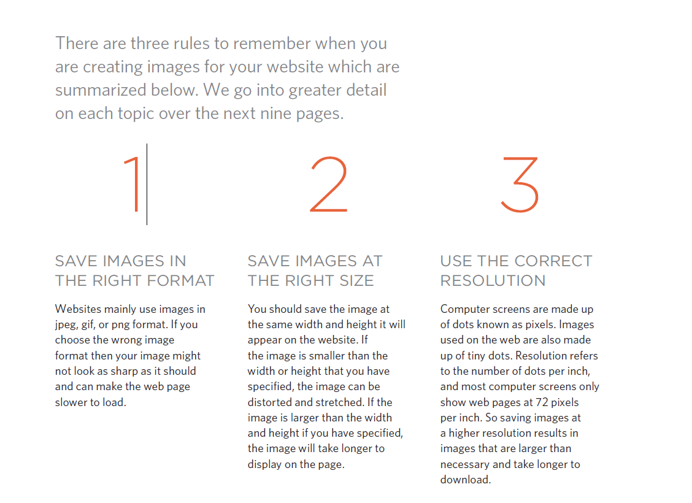
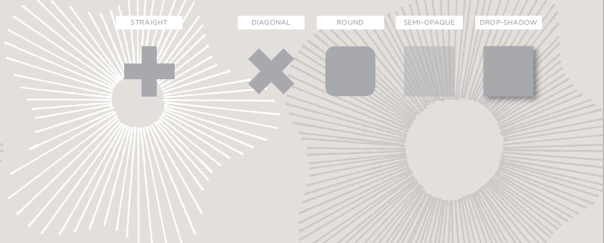
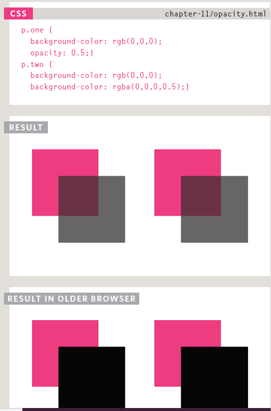
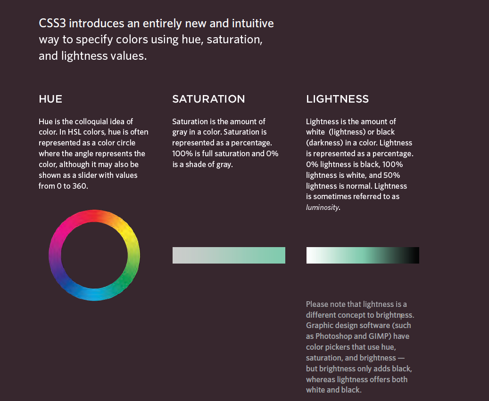
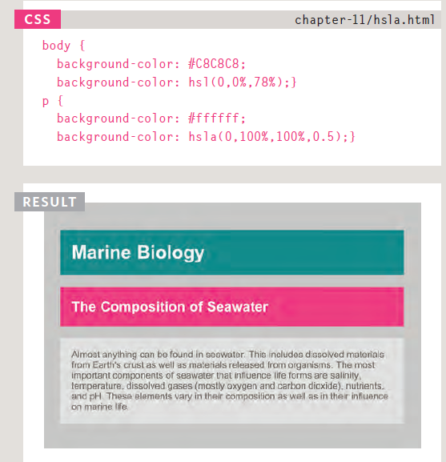

# Read: 05 - HTML Images; CSS Color & Text
## Chapter 5: “Images” 
### There are many reasons why you might want to add an image to a web page: you might want to include a logo, photograph,illustration, diagram, or chart.There are several things to consider when selecting and preparing images for your site, but taking time to get them right will make it look more attractive and professional.
- The  element is used to add images to aweb page.
- You must always specify a src attribute to indicate the source of an image and an alt attribute to describe the content of an image.
- You should save images at the size you will be using them on the web page and in the appropriate format.
- Photographs are best saved as JPEGs; illustrations or logos that use flat colors are better saved as GIFs.

## Image Formats
-------------------------------------------------------------
### DR
- JPEG : use with 
####   1.Whenever you have many different colors in a picture you should use a JPEG.
####   2.Large areas.
-  GIF or PNG : 
####   1.when saving images with few colors 

####   2.Large areas of the same color(FLAT colors)
-------------------------------------------------------------
### TL
#### bitmap :a type of image format  They are made up of lots of miniature squares. The resolution of an image is thenumber of squares that fit within a 1 inch x 1 inch square area

#### Vector Images:  Vector images differ from bitmap images and are resolution-independent. Vector images arecommonly created in programs such as Adobe Illustrator.
#### JPGs, GIFs, and PNGs belong to All have the same resolution of 72 pixels per inch(ppi)
-------------------------------------------------------------
### DR
### *Transparency*
#### Creating an image that is partially transparent (or "see-through") for the web involves selecting one of two formats:
#### Transparent GIF If the transparent part of the image has straight edges and it is 100% transparent (that is, not semi-opaque), you can save the image as a GIF (with the transparency option selected).
#### PNG If the transparent part of the image has diagonal or rounded edges or if you want a semiopaque transparency or a dropshadow, then you will need to save it as a PNG.

-------------------------------------------------------------
## Chapter 11: “Color”
#### Color not only brings your site to life, but also helpsconvey the mood and evokes reactions.
- There are three ways to specify colors in CSS:RGB values, hex codes, and color names.
- Color pickers can help you find the color you want.
- It is important to ensure that there is enough contrast
between any text and the background color (otherwise
people will not be able to read your content).
- CSS3 has introduced an extra value for RGB colors to indicate opacity. It is known as RGBA.

- CSS3 also allows you to specify colors as HSL values,
with an optional opacity value. It is known as HSLA.

-----------------------------------------------------------
## Chapter 12: “Text”
- There are properties to control the choice of font, size,
weight, style, and spacing.
- There is a limited choice of fonts that you can assume
most people will have installed.
- If you want to use a wider range of typefaces there are
several options, but you need to have the right license
to use them.
- You can control the space between lines of text,
individual letters, and words. Text can also be aligned
to the left, right, center, or justified. It can also be
indented.
-  You can use pseudo-classes to change the style of an
element when a user hovers over or clicks on text, or
when they have visited a link.
-----------------------------------------------------------
## Blog Post
|NAME | TL;DR |  Compression | Transparency | Animation |
|-----|-------|--------------|--------------|-----------|
|JBEG |USEfor all images that contain a natural scene or photograph where variation in colour and intensity is smooth|a lossy  specification compression|don’t support transparency|16 million colours|don’t support|
|PNG  |Use format for any image that needs transparency or for images with text & objects with sharp contrast edges like logos |a lossy DEFLATE compression|support transparency in two ways — inserting an alpha channel or declaring a single colour|have two modes — PNG8 and PNG24. PNG8 can support upto 256 colours whereas PNG24 can handle upto 16 million colours|don’t support|
|GIF  || LZW compression algorithm|support transparency by declaring a single colour|256 colours|GIF supports animation|

