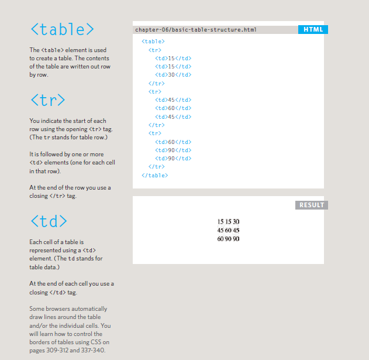
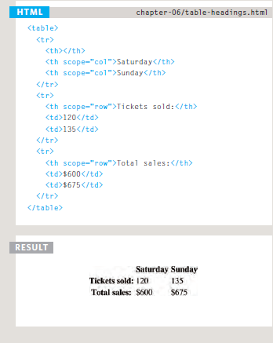
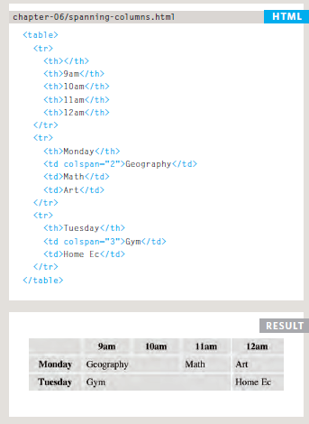

# Chapter 6: “Tables” 
## What's a Table?
### A table represents information in a grid format. Examples of tables include financial reports, TV schedules, and sports results.
- The \<table> element is used to add tables to a web
page.
- A table is drawn out row by row. Each row is created
with the \<tr> element.
- Inside each row there are a number of cells
represented by the \<td> element (or \<th> if it is a
header).
-You can make cells of a table span more than one row
or column using the rowspan and colspan attributes.
- For long tables you can split the table into a\ \<thead>\<tbody>, and\<tfoot>.

## Basic Table St ructure

## Table Headings\<th>
#### The \<th> element is used justlike the \<td> element but itspurpose is to represent theheading for either a column ora row. (The th stands for tableheading.)

## Spanning ColumnS
The colspan attribute can be
used on a \<th> or \<td> element
and indicates how many columns
that cell should run across

## Spanning Rows
The rowspan attribute can be
used on a <th> or <td> element
to indicate how many rows a cell
should span down the table.

