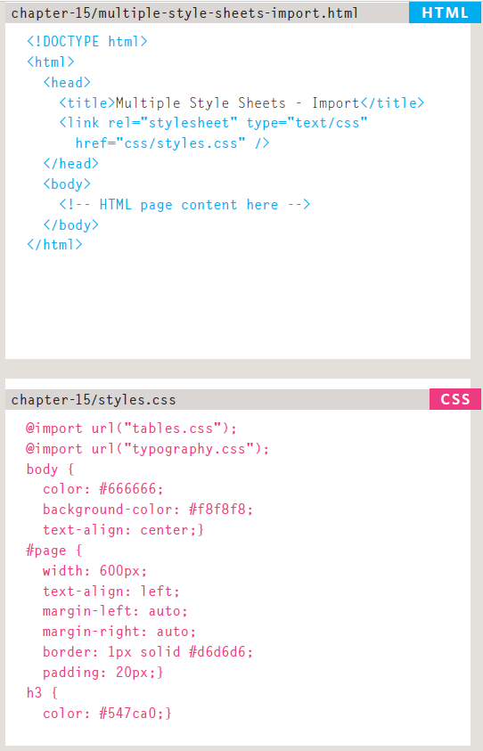
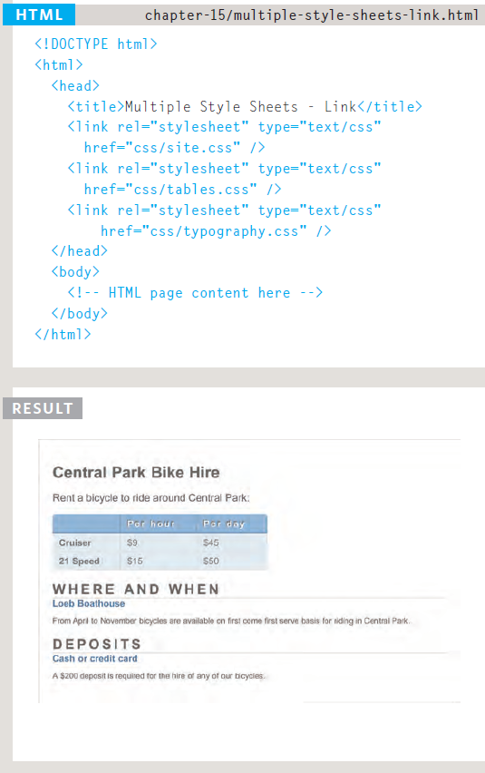

# Chapter 15: “Layout”
## Key Concepts in Positioning El ements
### Building Blocks
### CSS treats each HTML element as if it is in its own box. This box will either be a block-level box or an inline box. Block-level boxes start on a new line and act as the main building blocks of any layout, while inline boxes flow between surrounding text You can control how much space each box takes up by setting the width of theboxes (and sometimes the height, too). To separate boxes, you can use borders, margins, padding, and background colors.

## Page Sizes 
### Because screen sizes and display resolutions vary so much, webdesigners often try to create pages of around 960-1000 pixels wide (since most users will be able to see designs this wide on their screens).
- Fixed Width Layouts
 - Liquid Layouts
 - Layout Grids
 - 

 ## Fixed Width Layouts
 ### Fixed width layout
#### designs do not change size as the user increases or decreases the size of their browser window. Measurements tend to be given in pixels.
- Advantages
   - Pixel values are accurate
at controlling size and
positioning of elements.
  - The designer has far greater
control over the appearance
and position of items on the
page than with liquid layouts.
  - You can control the lengths
of lines of text regardless of
the size of the user's window.
  - The size of an image will
always remain the same
relative to the rest of the
page.
- Disadvantages
  - You can end up with big gaps
around the edge of a page.
  - If the user's screen is a much
higher resolution than the
designer's screen, the page
can look smaller and text can
be harder to read.
  - If a user increases font sizes,
text might not fit into the
allotted spaces.
  - The design works best on
devices that have a site or
resolution similar to that of
desktop or laptop computers.
  - The page will often take up
more vertical space than a
liquid layout with the same
content.

## Liquid Layouts
### Liquid layout designs stretch and contract as the user increases or decreases the size of their browser window. They tend to use percentages.
  - ex
  ![]../img/201/(class-081.png)

  ## Layout Grids
  ### Composition in any visual art (such as design, painting, or photography) is the placement or arrangement of visual elements — how they are organized on a page. Many designers use a grid structure to help them position items on a page, and the same is true for web designers.
  ### While a grid might seem like a restriction, in actual fact it:
  - Creates a continuity between
different pages which may
use different designs
- Helps users predict where to
find information on various
pages
- Makes it easier to add new
content to the site in a
consistent way
- Helps people collaborate
on the design of a site in a
consistent way
## Multiple Style Sheets
- @import
- link
### ex 

