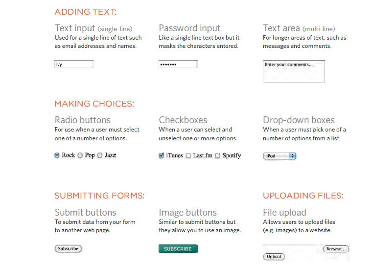
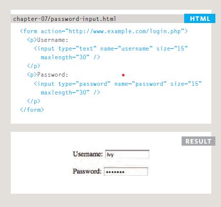

# Forms and JS Events
## Why Forms?
- To enabling users to
search, forms 
- allow users
to perform other functions
online. You will see forms
when registering as a member
of a website, when shopping
online, and when signing up for
newsletters or mailing lists.

## Form Controls
### There are several types of form controls that you can use to collect information from visitors to your site.

- For example :password input:

----------------------------------------
# Lists, Tables and Forms
- List markers can be given different appearances
using the list-style-type and list-style image
properties.
- Table cells can have different borders and spacing in
different browsers, but there are properties you can
use to control them and make them more consistent.
- Forms are easier to use if the form controls are
vertically aligned using CSS.
- Forms benefit from styles that make them feel more
interactive
--------------------------------------
