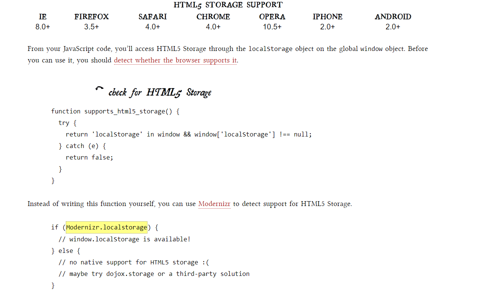

# THE PAST, PRESENT & FUTURE OF LOCAL STORAGE FOR WEB APPLICATIONS
### prsistent local storage is one of the areas where native client applications have held an advantage over web applications. For native applications, the operating system typically provides an abstraction layer for storing and retrieving application-specific data like preferences or runtime state. These values may be stored in the registry, INI files, XML files, or some other place according to platform convention. If your native client application needs local storage beyond key/value pairs, you can embed your own database, invent your own file format, or any number of other solutions.

### Historically, web applications have had none of these luxuries. Cookies were invented early in the web’s history, and indeed they can be used for persistent local storage of small amounts of data. But they have three potentially dealbreaking downsides:
- Cookies are included with every HTTP request, thereby slowing down your web application by needlessly transmitting the same data over and over
- Cookies are included with every HTTP request, thereby sending data unencrypted over the internet (unless your entire web application is served over SSL)
- Cookies are limited to about 4 KB of data — enough to slow down your application (see above), but not enough to be terribly useful

### What we really want is

- a lot of storage space
- on the client
- that persists beyond a page refresh
- and isn’t transmitted to the server
### Before HTML5, all attempts to achieve this were ultimately unsatisfactory in different ways.

## INTRODUCING HTML5 STORAGE
### What I will refer to as “HTML5 Storage” is a specification named Web Storage, which was at one time part of the HTML5 specification proper, but was split out into its own specification for uninteresting political reasons. Certain browser vendors also refer to it as “Local Storage” or “DOM Storage.” The naming situation is made even more complicated by some related, similarly-named, emerging standards that I’ll discuss later in this chapter.

### So what is HTML5 Storage? Simply put, it’s a way for web pages to store named key/value pairs locally, within the client web browser. Like cookies, this data persists even after you navigate away from the web site, close your browser tab, exit your browser, or what have you. Unlike cookies, this data is never transmitted to the remote web server (unless you go out of your way to send it manually). Unlike all previous attempts at providing persistent local storage, it is implemented natively in web browsers, so it is available even when third-party browser plugins are not.

### Which browsers? Well, the latest version of pretty much every browser supports HTML5 Storage… even Internet Explorer!

## USING HTML5 STORAGE
### HTML5 Storage is based on named key/value pairs. You store data based on a named key, then you can retrieve that data with the same key. The named key is a string. The data can be any type supported by JavaScript, including strings, Booleans, integers, or floats. However, the data is actually stored as a string. If you are storing and retrieving anything other than strings, you will need to use functions like parseInt() or parseFloat() to coerce your retrieved data into the expected JavaScript datatype.
         interface Storage {
        getter any getItem(in DOMString key);
          setter creator void setItem(in DOMString key, in any data);
               };

### Calling setItem() with a named key that already exists will silently overwrite the previous value. Calling getItem() with a non-existent key will return null rather than throw an exception.

### Like other JavaScript objects, you can treat the localStorage object as an associative array. Instead of using the getItem() and setItem() methods, you can simply use square brackets. For example, this snippet of code:
            var foo = localStorage.getItem("bar");
                 // ...
                localStorage.setItem("bar", foo);
              …could be rewritten to use square bracket syntax    instead:

             var foo = localStorage["bar"];
                // ...
                  localStorage["bar"] = foo; 

### There are also methods for removing the value for a given named key, and clearing the entire storage area (that is, deleting all the keys and values at once).
          interface Storage {
        deleter void removeItem(in DOMString key);
         void clear();
             };
### Calling removeItem() with a non-existent key will do nothing.

### Finally, there is a property to get the total number of values in the storage area, and to iterate through all of the keys by index (to get the name of each key).
                   interface Storage {
                readonly attribute unsigned long length;
             getter DOMString key(in unsigned long index);
               };
### If you call key() with an index that is not between 0–(length-1), the function will return null.

## HTML5 STORAGE IN ACTION
### Let’s see HTML5 Storage in action. Recall the Halma game we constructed in the canvas chapter. There’s a small problem with the game: if you close the browser window mid-game, you’ll lose your progress. But with HTML5 Storage, we can save the progress locally, within the browser itself. Here is a live demonstration. Make a few moves, then close the browser tab, then re-open it. If your browser supports HTML5 Storage, the demonstration page should magically remember your exact position within the game, including the number of moves you’ve made, the position of each of the pieces on the board, and even whether a particular piece is selected.

### As you can see, it uses the localStorage object to save whether there is a game in progress (gGameInProgress, a Boolean). If so, it iterates through the pieces (gPieces, a JavaScript Array) and saves the row and column number of each piece. Then it saves some additional game state, including which piece is selected (gSelectedPieceIndex, an integer), whether the piece is in the middle of a potentially long series of hops (gSelectedPieceHasMoved, a Boolean), and the total number of moves made so far (gMoveCount, an integer).

### On page load, instead of automatically calling a newGame() function that would reset these variables to hard-coded values, we call a resumeGame() function instead. Using HTML5 Storage, the resumeGame() function checks whether a state about a game-in-progress is stored locally. If so, it restores those values using the localStorage object.

### The most important part of this function is the caveat that I mentioned earlier in this chapter, which I’ll repeat here: Data is stored as strings. If you are storing something other than a string, you’ll need to coerce it yourself when you retrieve it. For example, the flag for whether there is a game in progress (gGameInProgress) is a Boolean. In the saveGameState() function, we just stored it and didn’t worry about the datatype:

         localStorage["halma.game.in.progress"] = gGameInProgress;
### But in the resumeGame() function, we need to treat the value we got from the local storage area as a string and manually construct the proper Boolean value ourselves:

       gGameInProgress = (localStorage["halma.game.in.progress"]     == "true");
### Similarly, the number of moves is stored in gMoveCount as an integer. In the saveGameState() function, we just stored it:

        localStorage["halma.movecount"] = gMoveCount;
### But in the resumeGame() function, we need to coerce the value to an integer, using the parseInt() function built into JavaScript:

        gMoveCount = parseInt(localStorage["halma.movecount"]);