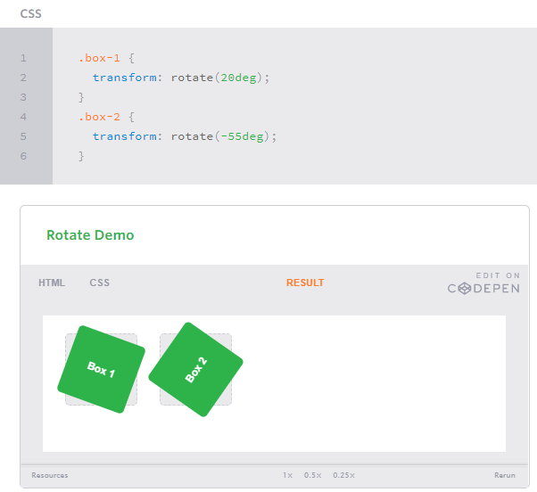
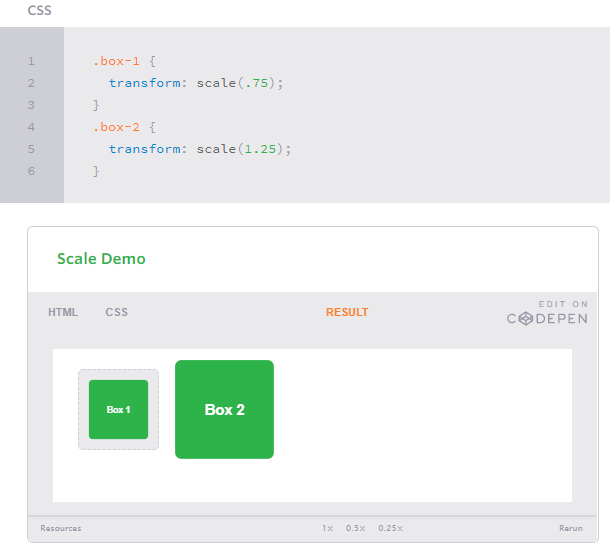
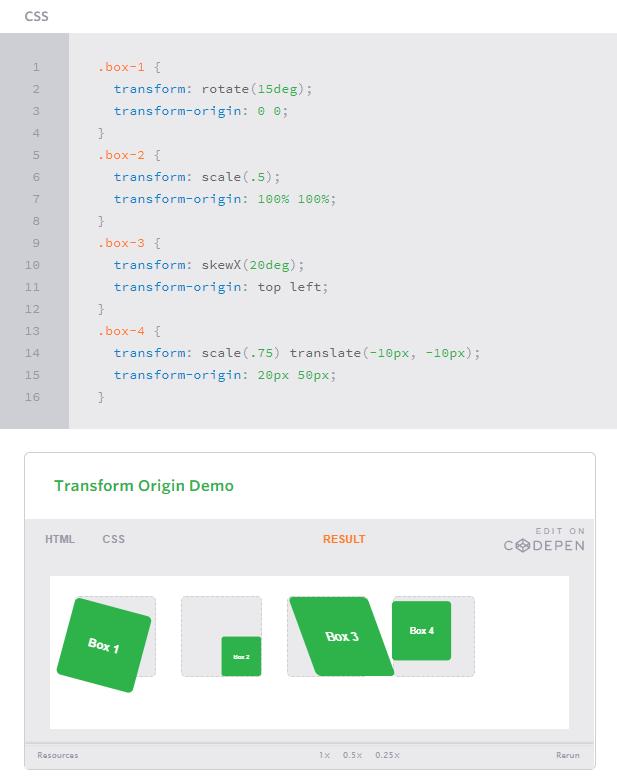
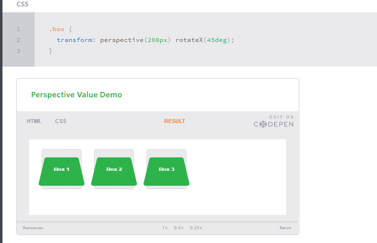
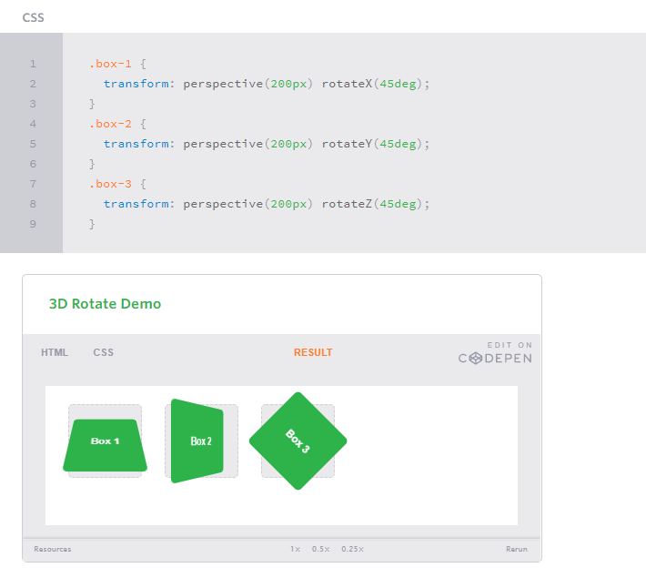
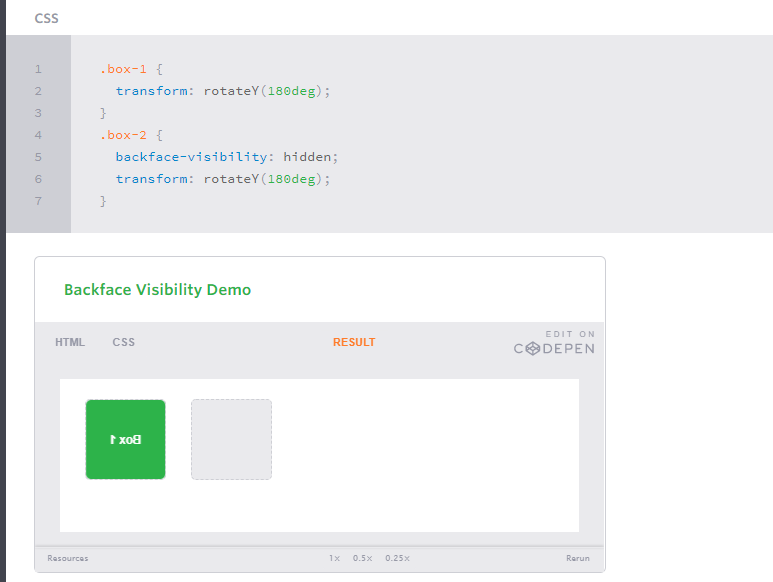

# Transforms
### ith CSS3 came new ways to position and alter elements. Now general layout techniques can be revisited with alternative ways to size, position, and change elements. All of these new techniques are made possible by the transform property.

### The transform property comes in two different settings, two-dimensional and three-dimensional. Each of these come with their own individual properties and values.

## 2D Transforms
### This example this two line in html and how transforms it with css
              <figure class="box-1">Box 1</figure>
              <figure class="box-2">Box 2</figure>

### 2D Rotate 
     .box-1 {
                      transform: rotate(20deg);
                                                   }
     .box-2 {
                      transform: rotate(-55deg);
                                                   }

----------------------------------------------------------------
## 2D Scale

------------------------------------------------------------------
## Transform Origin

------------------------------------------------------------------
## Perspective

-----------------------------------------------------------------
## 3D Transforms

-----------------------------------------------------------------
## Backface Visibility#backface-visibility

------------------------------------------------------------------
# Transitions & Animations
## Transitions
#### As mentioned, for a transition to take place, an element must have a change in state, and different styles must be identified for each state. The easiest way for determining styles for different states is by using the :hover, :focus, :active, and :target pseudo-classes.

#### There are four transition related properties in total, including transition-property, transition-duration, transition-timing-function, and transition-delay. Not all of these are required to build a transition, with the first three are the most popular.
------------------------------------------------------------------
## Animations#animations
#### Transitions do a great job of building out visual interactions from one state to another, and are perfect for these kinds of single state changes. However, when more control is required, transitions need to have multiple states. In return, this is where animations pick up where transitions leave off.

### Animations Keyframes
#### To set multiple points at which an element should undergo a transition, use the @keyframes rule. The @keyframes rule includes the animation name, any animation breakpoints, and the properties intended to be animated.
-----------------------------------------------------------------
##  SIMPLE CSS3 TRANSITIONS THAT WILL WOW YOUR USERS
### 1. Fade in
                         .fade
                    {
                          opacity:0.5;
                                            }
                            .fade:hover
                                   {
                               opacity:1;
                                            }
### 2.  Change color
              .color:hover
                           {
                                         background:#53a7ea;
                                        }  
### 3. Grow & Shrink
      .grow:hover
     {
        -webkit-transform: scale(1.3);
        -ms-transform: scale(1.3);
        transform: scale(1.3);
        }

