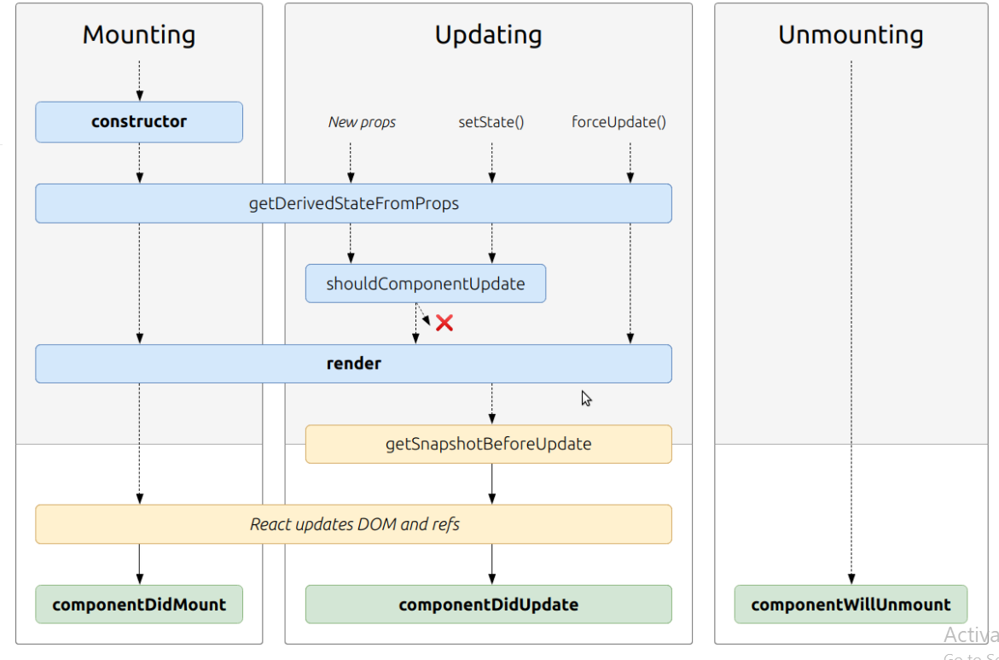

# State and Props
## Based off the diagram, what happens first, the ‘render’ or the ‘componentDidMount’?
### ‘render’

## What is the very first thing to happen in the lifecycle of React?
### Mounting
### When an instance of a component is being created and inserted into the DOM it occurs during the mounting phase. Constructor, static getDerivedStateFromProps, render, componentDidMount, and UNSAFE_componentWillMount all occur in this order during mounting.
-----------------------------------
## Put the following things in the order that they happen: componentDidMount, render, constructor, componentWillUnmount, React Update
1. constructor
2. render
3. React Update
4. componentDidMount
5. componentWillUnmount
-----------------------------------------------------------
## What does componentDidMount do?
## This method is invoked immediately after a component is mounted. If you need to load anything using a network request or initialize the DOM, it should go here. This method is a good place to set up any subscriptions. If you do that, don’t forget to unsubscribe in componentWillUnmount().
## setState() can be called here, but it should be used sparingly, because it will cause a rerender, which can lead to perfomance issues.
## Here we use componentDidMount() to connect to the YouTube API and get videos when the components is rendered.
---------------------------------
## What types of things can you pass in the props?

### It accepts  (an object),  (a string), and  (a date) as props, and describes a comment on a social media website.
------------------------------------
## What is the big difference between props and state?
state is handled in the component and you can update it inside the component while props are handled outside the component and must be update outside of the component 

## When do we re-render our application?
props change at some point it will re-reander
## What are some examples of things that we could store in state?
counter,form

 ## [check her to read more ](https://medium.com/@joshuablankenshipnola/react-component-lifecycle-events-cb77e670a093)

 ## [check her to see the vidio ](https://www.youtube.com/watch?v=IYvD9oBCuJI)

 ## Things I want to know more about
how we use state??

