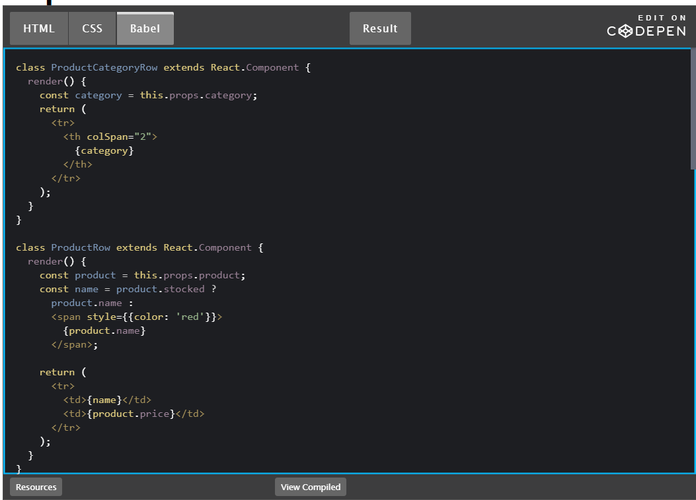

# Putting it all together
## How would you break a mock into a component heirarchy?

But how do you know what should be its own component? Use the same techniques for deciding if you should create a new function or object. One such technique is the single responsibility principle, that is, a component should ideally only do one thing. If it ends up growing, it should be decomposed into smaller subcomponents.

Since you’re often displaying a JSON data model to a user, you’ll find that if your model was built correctly, your UI (and therefore your component structure) will map nicely. That’s because UI and data models tend to adhere to the same information architecture. Separate your UI into components, where each component matches one piece of your data model.

## What is the single responsibility principle and how does it apply to components?
The single-responsibility principle (SRP) is a computer-programming principle that states that every module, class or function in a computer program should have responsibility over a single part of that program's functionality, and it should encapsulate that part. All of that module, class or function's services should be narrowly aligned with that responsibility.
## What does it mean to build a ‘static’ version of your application?

takes your data model and renders the UI but has no interactivity. It’s best to decouple these processes because building a static version requires a lot of typing and no thinking, and adding interactivity requires a lot of thinking and not a lot of typing
## Once you have a static application, what do you need to add?

## What are the three questions you can ask to determine if something is state?
- Is it passed in from a parent via props? If so, it probably isn’t state.
- Does it remain unchanged over time? If so, it probably isn’t state.
- Can you compute it based on any other state or props in your component? If so, it isn’t state.

## How can you identify where state needs to live?
For each piece of state in your application:

- Identify every component that renders something based on that state.
- Find a common owner component (a single component above all the components that need the state in the hierarchy).
- Either the common owner or another component higher up in the hierarchy should own the state.
- If you can’t find a component where it makes sense to own the state, create a new component solely for holding the state and add it somewhere in the hierarchy above the common owner component.
## [check her to read more ](https://reactjs.org/docs/thinking-in-react.html)