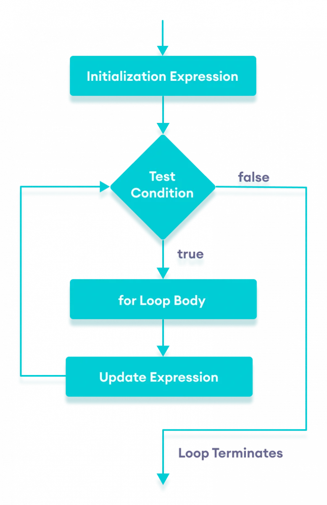

# Arrays, Loops, Imports

A java package is a group of similar types of classes, interfaces and sub-packages.

Package in java can be categorized in two form, built-in package and user-defined package.

There are many built-in packages such as java, lang, awt, javax, swing, net, io, util, sql 

so the first  line in java must be package declaration we have three type of the package declaration 
1. Package statment (i dont understand it)
2. Imports 
3. Class or interface definitions
the first and secand way optional to use but third it must

## Imports 
I will take about import package of class 
we can Importing  diff way
- Importing all the classes   : import packageName.*;
- Importing specific class :import packageName.*;  or without import word 

If you forgot to write import statements there is some thing called NetBeans this will do using right click on the source file and choose Fix Imports or alt+enter (I try this)

----------------------------------------------------------
## loop
## What is for loop in Java?
loops are used to repeat a block of code
Here are the types of loops that we can find in Java:
-  for loop
-  for-each loop
- While loop or do\While loop
### -  for loop

example:
      
      for (int i = 1; i <= n; ++i) {
      // body inside for loop
      sum += i;     // sum = sum + i
    }

### for-each loop
The Java for loop has an alternative syntax that makes it easy to iterate through arrays and collections
example :
          
          // create an array
    int[] numbers = {3, 7, 5, -5};
    
    // iterating through the array 
    for (int number: numbers) {
       System.out.println(number);
    }

###  While loop or do\While loop
we use it almost to unknown alternative 

      while (testExpression) {
    // body of loop
}

if we need to execete some thing before while use do to ececete after that while

