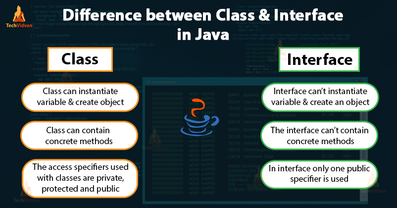

# Inheritance and Interfaces
## What Is an Object?
A Java object is a member (also called an instance) of a Java class. Each object has an identity, a behavior and a state.

The state of an object is stored in fields (variables), while methods (functions) display the object's behavior. Objects are created at runtime from templates, which are also known as classes.

## What Is a Class?
A class is a blueprint or prototype from which objects are created
it hasnt any place in momery has a defulte constractar can use statice or object to access the memory

# Interfaces 
in Java, an interface is a blueprint or template of a class. It is much similar to the Java class but the only difference is that it has abstract methods and static constants.

an abstract method is a method that is declared without implementation. An abstract class may or may not have all abstract methods. Some of them can be concrete methods. 
# Inheritance
One of the core principles of Object-Oriented Programming – inheritance – enables us to reuse existing code or extend an existing type.

Simply put, in Java, a class can inherit another class and multiple interfaces, while an interface can inherit other interfaces.

# ok but what the relationship btween all this infromation how we will use it to gather