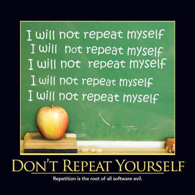

## Rule of three (computer programming)
if we reapet same step in code three time that mean the code require refactoring because when the code reapet that make makes the code harder to maintain

Correct abstractions correctly separate responsibilities. They clarify the intent of the code. They prevent code duplication.

When you find the correct abstractions, you can feel these 4 classes are actually simpler to maintain than the original 30 lines of code.

### DRY — Don’t Repeat Yourself.
According to this principle, a single piece of information should be present in only one place and in an authoritative manner in your system.

1. Always think of your code as a series of smaller modules that will work in conjunction with each other.
2. Think of code that will be reusable and try to form utility classes.
3. Divide your logic and lock them in a simple short sequence of code.
4. If you want your code to be written in Object-oriented fashion, think of behaviours that can be classified in classes.
5. Remember less code, less maintainability.

## WET
Write Every Time or the WET principle is when you don’t follow the DRY principle. I think the more appropriate way of putting this is — Waste Everyone’s Time.

## You aren't gonna need it"(YAGNI)
we musnt write code for some thing we arent using it try to make the code as you can simple.

## Minimal Viable Product (MVP)
we do not need a completed product to test our most risky assumptions this way you avoid a lot of waste if customers turn out to want something else. Therefore test with a Minimal Viable Product (MVP). This is the smallest, fastest way to create version of a product that you will be testing. An MVP can be a video, a landing page but also a physical product. This way you avoid a lot of waste if customers turn out to want something else.

## if the good code shoud clean simple small and separate to save time and the code will reusable. 