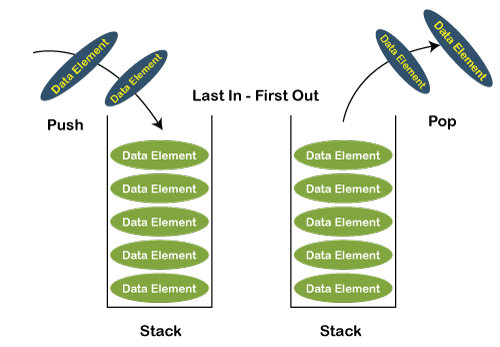
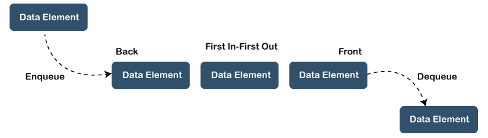

# Stacks and Queues
a stack is a collection that is based on the last-in-first-out (LIFO) policy.  we name the stack insert method push() and the stack remove operation pop(). We also include a method to test whether the stack is empty
a linear data structure

Static: The static implementation of the stack can be done with the help of arrays
Dynamic: The dynamic implementation of the stack can be done with the help of a linked list

## Examples of stacks in "real life":
The stack of trays in a cafeteria
A stack of plates in a cupboard
A driveway that is only one car wide.
Examples of stacks in computing:
Back/Forward stacks on browsers
Undo/Redo stacks in Excel or Word
Activation records of method calls

## Queues
 a linear data structure. It is an ordered list that follows the principle FIFO (First In -First Out
  In the case of Queue insertion is performed from one end, and that end is known as a rear end The deletion is performed from another end and that end is known as a front end 
  the technical words for insertion and deletion are enqueue() and dequeue(), respectively whereas, in the case of the stack Its structure contains two pointers front pointer and rear pointer, where the front pointer is a pointer that points to the element that was first added in the queue and the rear pointer that points to the element inserted last in the queue

## Examples of queues in "real life":
 a ticket line;
An escalator;
A car wash.
Examples of queues in computing:
A printer queue;
An input stream;

## Differences between stack and queue
Principle : stack LIFO (Last In- First Out),queues FIFO (First In -First Out)

Number of pointers used : stack one queues two

Variants:stack	It does not have any types.queue	It is of three types like priority queue, circular queue and double ended queue

