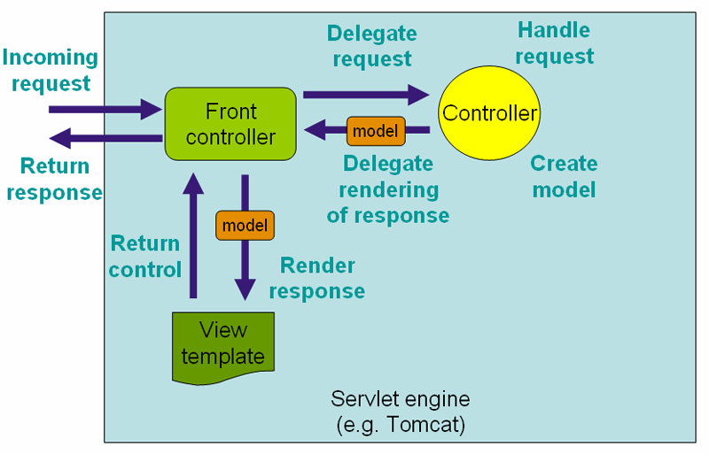
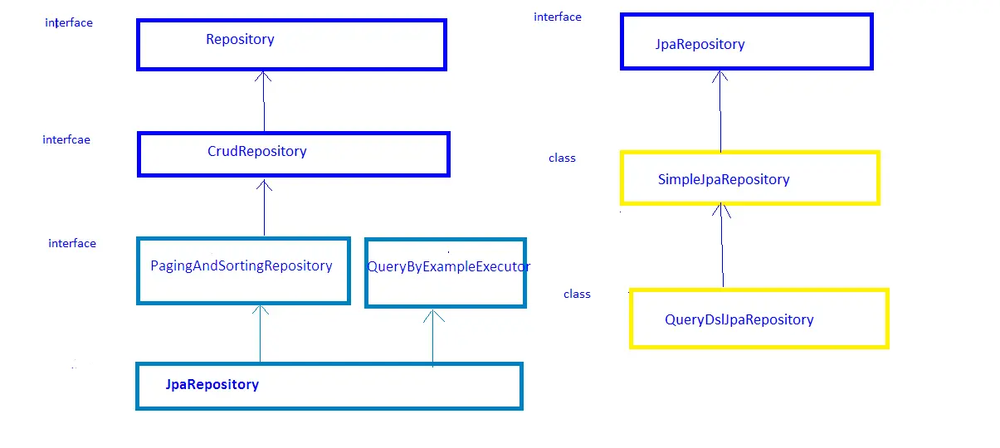

#  Spring RESTful Routing & Static Files
## Spring RequestMapping
In Spring MVC applications, the RequestDispatcher (Front Controller Below) servlet is responsible for routing incoming HTTP requests to handler methods of controllers.

When configuring Spring MVC, you need to specify the mappings between the requests and handler methods.

It has the following optional options

-  @RequestMapping — by Path
- @RequestMapping With the headers Attribute
- RequestMapping With Path Variables
-  RequestMapping With Request Parameters
- RequestMapping Corner Cases
example:

           @RequestMapping(value = "/ex/foos", method = RequestMethod.GET)
           @ResponseBody
            public String getFoosBySimplePath() {
              return "Get some Foos";
              }

## What Spring Data JPA Is?
pring Data JPA is not a JPA provider. It is a library / framework that adds an extra layer of abstraction on the top of our JPA provider. If we decide to use Spring Data JPA, the repository layer of our application contains three layers that are described in the following:

- Spring Data JPA provides support for creating JPA repositories by extending the Spring Data repository interfaces.
- Spring Data Commons provides the infrastructure that is shared by the datastore specific Spring Data projects.
- The JPA Provider implements the Java Persistence API.

## CrudRepository, JpaRepository, and PagingAndSortingRepository in Spring Data

I understand from the pic and from the reading the JpaRepository is have more methode  and have some diff btween them like what it is return  The saveAll(Iterable\<S> entities)  method of CrudRepository returns Iterable. in
CrudRepository and The saveAll(Iterable\<S> entities)  method of JpaRepository returns List.

-so if we need simple functionality  use CrudRepository
example :
We'll start with a simple Product entity:

     @Entity
      public class Product {

    @Id
    private long id;
    private String name;

    // getters and setters
       }

 - CrudRepository it has save(…) ,findOne(…),findAll() ,count()delete(…),exists(…) 

- PagingAndSortingRepository it has Page size,Current page number
,Sorting

- JpaRepository it has findAll() ,save(…);saveAndFlush(…) ;deleteInBatch(…) 

