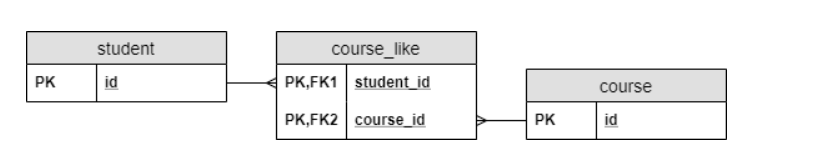

# Read: Class 13 Read: 13 - Related Resources and Integration Testing

Related data in Spring
## One-to-One Relationship
- @OneToOne...@JoinColumn(name = "address_id")

- @OneToOne(mappedBy = "address")

We must be careful to have different names for each association resource. Otherwise, we will encounter a JsonMappingException

create two repository interfaces for each of them, by extending the CrudRepository interface

public interface LibraryRepository extends CrudRepository<Library, Long> {}
public interface AddressRepository extends CrudRepository<Address, Long> {}

Let’s see some real-life examples of one-to-one relationships:

Country - capital city: Each country has exactly one capital city. Each capital city is the capital of exactly one country.

## One-to-Many Relationship
example :in the music streaming app example, suppose the user has the ability to organize their songs into playlists. Each user can create as many playlists as they want, but each playlist is created by exactly one user. Therefore, there should be a one-to-many relationship between the User entity and the Playlist entity.

 use this create relation  @OneToMany(mappedBy = "library") after that need  create a BookRepository:
 public interface BookRepository extends CrudRepository<Book, Long> { }
 add conction btween them as
 curl -i -X POST -d "{\"title\":\"Book1\"}" 
  -H "Content-Type:application/json" http://localhost:8080/books
## Many-to-Many Relationship
it is use to join the table. In a join table, the combination of the foreign keys will be its composite primary key.

      @ManyToMany(cascade = CascadeType.ALL)
    @JoinTable(name = "book_author", 
      joinColumns = @JoinColumn(name = "book_id", referencedColumnName = "id"), 
      inverseJoinColumns = @JoinColumn(name = "author_id", 
      referencedColumnName = "id"))

 use this create relation  @OneToMany(mappedBy = "library") after that need  create a BookRepository:
public interface AuthorRepository extends CrudRepository<Author, Long> { }

- this to add 

        @PostMapping("/role/create")
              public ResponseEntity<Object> createRole(@RequestBody Role role) {
        return  roleService.addRole(role);
             }

this to delete 

      @DeleteMapping("/role/delete/{id}")
      public ResponseEntity<Object> deleteRole(@PathVariable Long id) {
    return roleService.deleteRole(id);   
       }

this to read with spacfic

      @GetMapping("/role/details/{id}")
       public Role getRole(@PathVariable Long id) {

    if(roleRepository.findById(id).isPresent())
        return roleRepository.findById(id).get();
    else return null;
     }

read all

        @GetMapping("/role/all")
      public List<Role> getRoles() {
    return roleRepository.findAll();
      }

update 

       @PutMapping("/role/update/{id}")
         public ResponseEntity<Object> updateRole(@PathVariable Long id, @RequestBody Role role) {
    return roleService.updateRole(id, role);
          }

## Integration Testing in Spring
we add  Hamcrest and JSON path to dependencies running the integration tests 

use it to  It loads all the application beans and controllers into the context.

        @Autowired
          private WebApplicationContext webApplicationContext;

use this as public for all test 

        @BeforeEach
        public void setup() throws Exception {
    this.mockMvc = MockMvcBuilders.webAppContextSetup(this.webApplicationContext).build();
       }