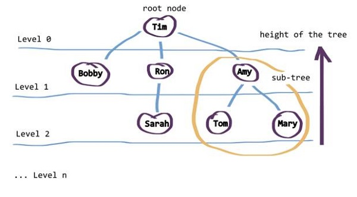
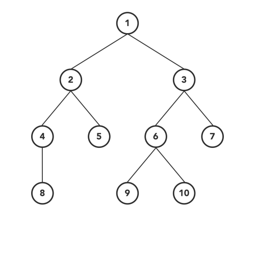

# Trees
A Tree is a non-linear data structure where data objects are organized in terms of hierarchical relationship. The structure is non-linear in the sense that, unlike simple array and linked list implementation, data in a tree is not organized linearly. Each data element is stored in a structure called a node. The topmost or starting node of the (inverted) tree is called the root node. All nodes are linked with an edge and form hierarchical sub trees beginning with the root node. Tree data structure is useful on occasions where linear representation of data do not suffice, such as creating a family tree. Java provides two in-built classes, TreeSet and TreeMap, in Java Collection Framework that cater to the needs of the programmer to describe data elements in the aforesaid form

### Java tree classes are actual implementations of a specific variety of the tree data structure.

the first nose called root node
middile called subtree
Sometimes, the ending nodes of the tree are called leaves.

The link between each of the nodes is called an edge. This link signifies the relationship that one node has with another, such as Amy‘s children, Bobby‘s sibling, Tim‘s descendant, and so forth.

Left - A reference to one child node, in a binary tree  like amy
Right - A reference to the other child node, in a binary tree like bobby

## what about rone

Height - The height of a tree is the number of edges from the root to the furthest leaf  here is 2

--------------------------------------------------
here are two categories of traversals when it comes to trees:

- Depth First
- Breadth First

## Depth First
1. in order
herefore, we will start from the root node of the tree and go deeper-and-deeper into the left subtree with recursive manner.
the step is :
- Go to left-subtree
- Visit Node
- Go to right-subtree

2. pre -order
- Order of the steps will be like…
- Visit Node
- Go to left-subtree
- Go to right-subtree

3. Post-order
- the sequence of the steps will be…
- Go to left-subtree
- Go to right-subtree
- Visit Node

----------------------------------------------------------
## Breadth-first search (BFS)
This is a different traversal than what we have covered above. Level order traversal follows BFS(Breadth-First Search) to visit/modify every node of the tree.
As BFS suggests, the breadth of the tree takes priority first and then move to depth. In simple words, we will visit all the nodes present at the same level one-by-one from left to right and then move to the next level to visit all the nodes of that level.

