# The Structure of HTML& CSS book:

**In order to teach you about creating web pages, 
this book is divided into three sections**

** 1.HTML : is used to create web pages.**

** 2.CSS  : uses rules to enable you to control the styling and layout of web pages by two categories:**
- Presentation : How to control things like the color of text, the fonts you want to use and the size of those fonts, how to add background colors to pages.
- Layout: How to control where the different elements are positioned on the screen. You will also learn several techniques that professionals use to make their pages more attractive.

** 3.Practical : We end up with some helpful
information that will assist you in
building better websites**

## How People Access the Web
#### Before we look at the code used to build websites it is important to consider the different ways in which people access the web and clarify some terminology.
- ** Browsers** : People access websites using software called a web browser.Popular examples include Firefox.

- ** Web Servers** : When you ask your browser for a web page, the request is sent across the Internet to a special
computer known as a web server which hosts the website.Web servers are special computers that are constantly connected to the Internet, and are optimized to send web pages out to people who request them. Some big companies run their own web servers, but it is more common to use the services of a web hosting company who charge a fee to host your site.

- **Devices : ** People are accessing websites
on an increasing range of devices
including desktop computers,
laptops.
- ** Screen readers : ** Screen readers are programs that read out the contents of acomputer screen to a user. They are commonly used by people with visual impairments.
## How Websites Are Created 
#### All websites use HTML and CSS, but content management systems, blogging software, and e-commerce platforms often add a few more technologies into the mix.
## How the Web Works
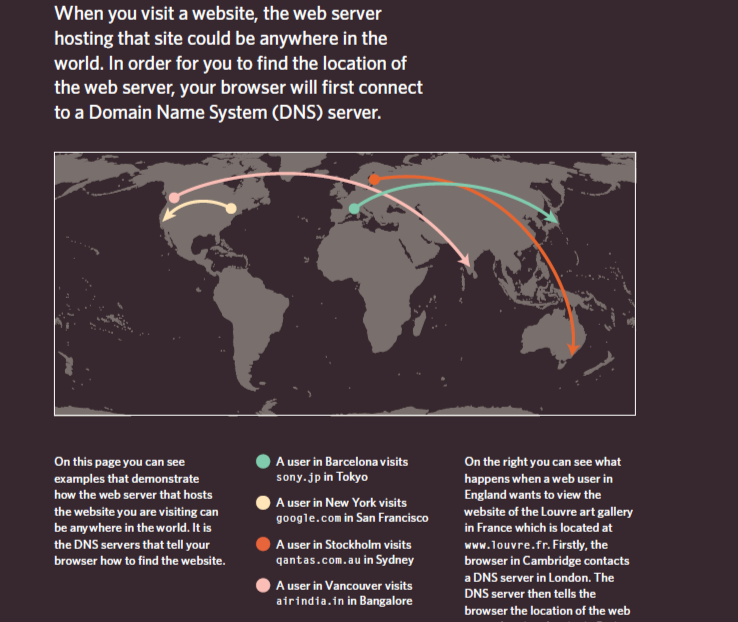

<<<<<<< HEAD
# chap1:  Structure
#### structure is very important in helping readers to understand the messages you are trying to convey and to navigate around the document. So, you must to know this information:
- HTML pages are text documents.
- HTML uses tags (characters that sit inside angled brackets) to give   the information they surround special meaning.
- Tags are often referred to as elements.
#### example : 
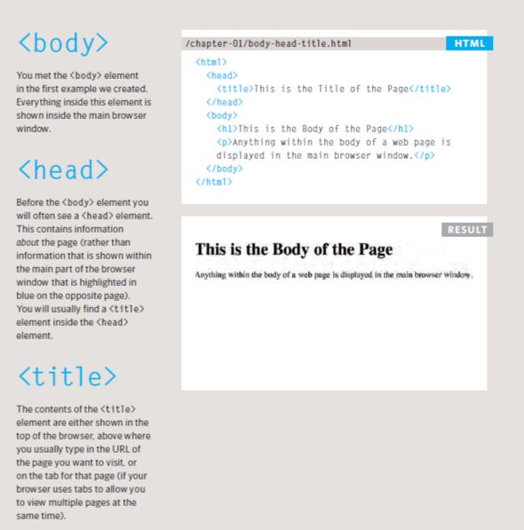

- Tags usually come in pairs. The opening tag denotes the start of a    piece of content; the closing tag denotes the end.
#### example : 
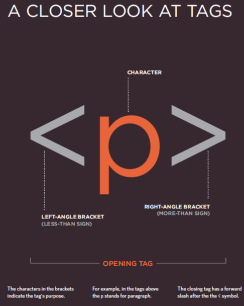
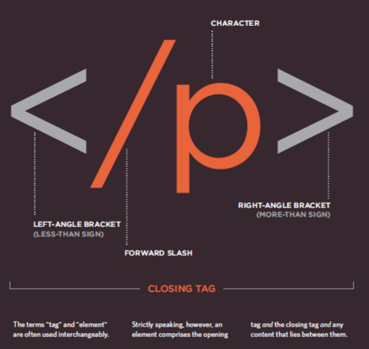
- Opening tags can carry attributes, which tell us more about the       content of that element.
- Attributes require a name and a value.
#### example : 
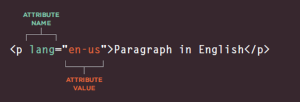
- To learn HTML you need to know what tags are available for you to     use, what they do, and where they can go.
## chap8: Extra Markup
- DOCTYPES tell browsers which version of HTML you using.
#### example : 
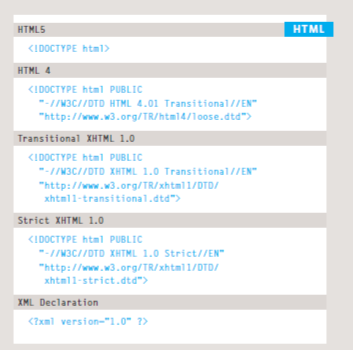
- You can add comments to your code between the <!-- and --> markers.
- The id and class attributes allow you to identify particular  elements
#### example : 
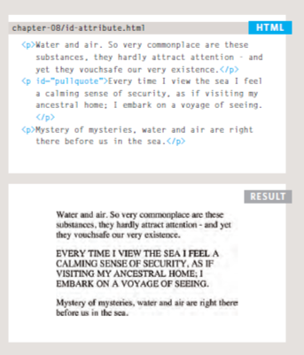
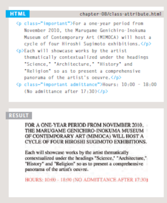.

-  Block level elements : it is some elements will always appear to start on a new line in the browser window.
- Inline elements it is some elements will always appear to continue on the same line as their neighbouring elements.
- The 
 and  elements allow you to group block-level and inline elements together.
#### example : 
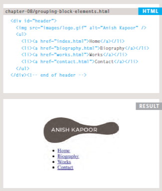

- <iframes> cut windows into your web pages through which other pages can be displayed.
#### example : 
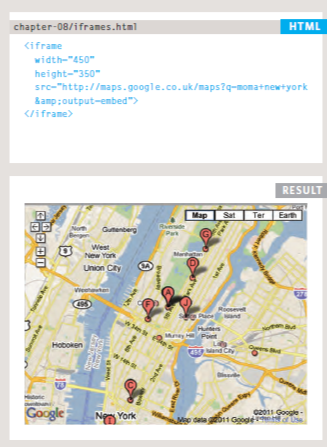

- The <meta> tag allows you to supply all kinds of information about your web page.
#### example : 
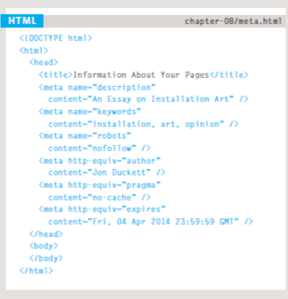
- Escape characters are used to include special characters in your pages such as <, >, and ©.
 ### chap17: HTML5 Layout
- The new HTML5 elements indicate the purpose of different parts of a web page and help to describe its structure.
- The new elements provide clearer code (compared with using multiple  
 elements).
- Older browsers that do not understand HTML5 elements need to be told which elements are block-level elements.
- To make HTML5 elements work in Internet Explorer 8 (and older versions of IE), extra JavaScript is needed, which is available free from Google.
### chap18: 
- It's important to understand who your target audience is to know them you must ask your self some questions

#### example : 
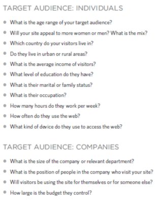
- Why they would come to your site : there are two basic categories of questions you can ask:The first attempts to discover the underlying motivations for why visitors come to the site and the second examines the specific goals of the visitors. These are the triggers making them come to the site now.
#### example : 
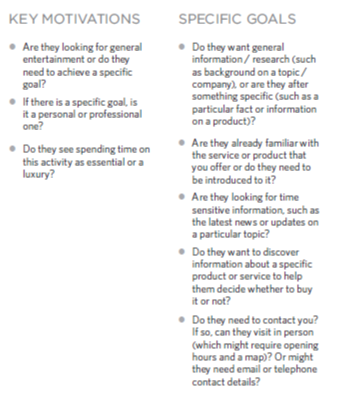

- what information they want to find and when they are likely to return, Here are some questions to help you decide what information to provide for visitors to your site...
#### example : 
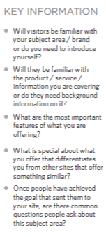
-Site map : it is create a diagram of the pages that will be used to structure the site.
- Site maps allow you to plan the structure of a site.
- To help you decide what information should go on each page, you can use a technique called card sorting.
#### example : 
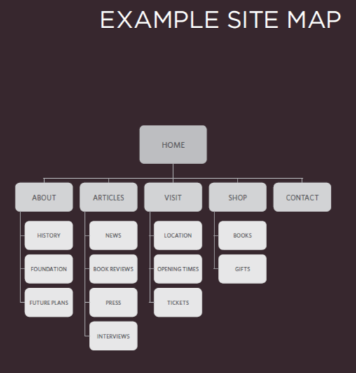
- A wireframe is a simple sketch of the key information that needs to go on each page of a site. It shows the hierarchy of the information and how much space it might require.
- Wireframes allow you to organize the information that will need to go on each page.
#### example : 
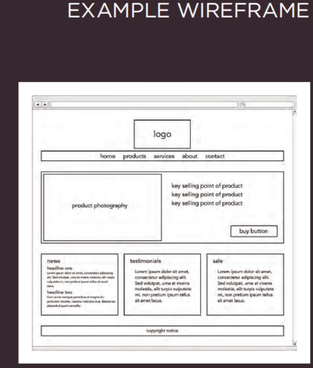
- Design is about communication. Visual hierarchy helps visitors understand what you are trying to tell them.
- You can differentiate between pieces of information using size, color, and style. 
- You can use grouping and similarity to help simplify the      information you present.

# JavaScript book:
*what is a script and how to create one:*
- A script is a series of instructions that the computer can follow     in order to achieve a goal. 
- Each time the script runs, it might only use a subset of all the      instructions. 
- Computers approach tasks in a different way than humans, so your      instructions must let the computer solve the task prggrammatically. 
- To approach writing a script, break down your goal into 
  a series of tasks and then work out each step needed 
  to complete that task (a flowchart can help).
*How to write a script for a web page:*
- It is best to keep JavaScript code in its own JavaScript file.        JavaScript files are text files (like HTML pages and CSS style        sheets), but they have the j s extension. 
- The HTML <script> element is used in HTML pages to tell the browser   to load the JavaScript file (rather like the <link> element can be    used to load a CSS file). 
- If you view the source code of the page in the browser,the    JavaScript will not have changed the HTML,because the script works    with the model of the web page that the browser has created.

