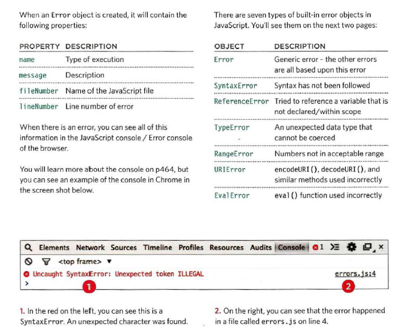

# “Error Handling & Debugging”
### JavaScript can be hard to learn and everyone makes mistakes when writing it. This chapter will help you learn how to find the errors in your code. It will also teach you how to write scripts that deal with potential errors gracefully.
### If you understand execution contexts (which have twostages) and stacks, you are more likely to find the errorin your code.
## ORDER OF EXECUTION
### To find the source of an error, it helps to know how scripts are processed.The order in which statements are executed can be complex; some tasks cannot complete until another statement or function has been run
## EXECUT.ION CONTEXTS
### The JavaScript interpreter uses the concept of execution contexts.here is one global execution context; plus, each function creates a new execution context. They correspond to variable scope.

## The stacks

## EXECUTION CONTEXT & HOISTING
Each time a script enters a new execution context, there are two phases
of activity:
1. PREPARE
- The new scope is created
- Variables, functions, and arguments are created
- The value of the this keyword is determined
2. EXECUTE
- Now it can assign values to variables
- Reference functions and run their code
- Execute statements

## UNDERSTANDING SCOPE
### In the interpreter, each execution context has its own va ri ables object.
## It holds the variables, functions, and parameters available within it.
## Each execution context can also access its parent's v a ri ables object.

## UNDERSTANDING ERRORS
### If a JavaScript statement generates an error, then it throws an exception.
 ### At that point, the interpreter stops and looks for exception-handling code.

 ## ERROR OBJECTS
 ### Error objects can help you find where your mistakes are and browsers have tools to help you read them.
 

- Debugging is the process of finding errors. It involves a
process of deduction.
- The console helps narrow down the area in which the
error is located, so you can try to find the exact error.
- JavaScript has 7 different types of errors. Each creates
its own error object, which can tell you its line number
and gives a description of the error.
- If you know that you may get an error, you can handle
it gracefully using the try, catch, finally statements.
Use them to give your users helpful feedback.

