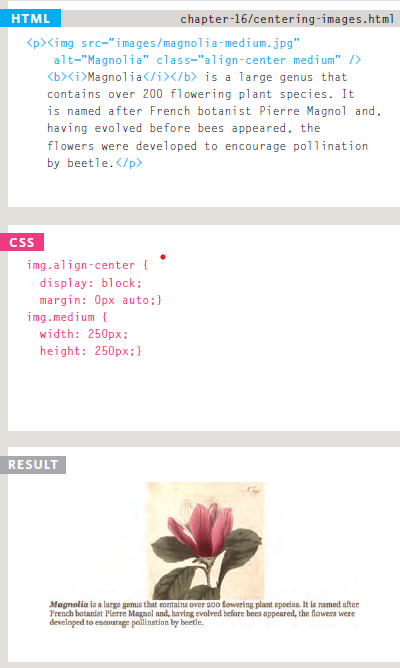

# Readings : Audio, Video, Images
# Chapter 16: “Images”
### Controlling the size and alignment of your images using CSS keeps rules that affect the presentation of your page in the CSS and out of the HTML markup.
## AligNi ng images Using CSS

## Centering images Using CSS

## shorthand background
### you can write like this example:
1. background-color
2. background-image
3. background-repeat
4. background-attachment
5. background-position

- You can create image rollover effects by moving the
background position of an image.
- To reduce the number of images your browser has to
load, you can create image sprites
# Chapter 19: “Practical Information” 
### To wrap up the book we are going to look at some practical information that will help you launch a successful site.
## Search engine optimization:
### SEO is a huge topic and several books have been written on the subject.The following pages will help you understand the key concepts so you can improve your website's visibility on search engines.
###  Search engine optimization (SEO) helps visitors find your sites when using search engines.
###  On-Page SEO

- ### Analytics tools such as Google Analytics allow you tosee how many people visit your site, how they find it,and what they do when they get there.
- ### To put your site on the web, you will need to obtain domain name and web hosting.
- ### FTP programs allow you to transfer files from your local computer to your web server.
- ### Many companies provide platforms for blogging, email newsletters, e-commerce and other popular website tools (to save you writing them from scratch).