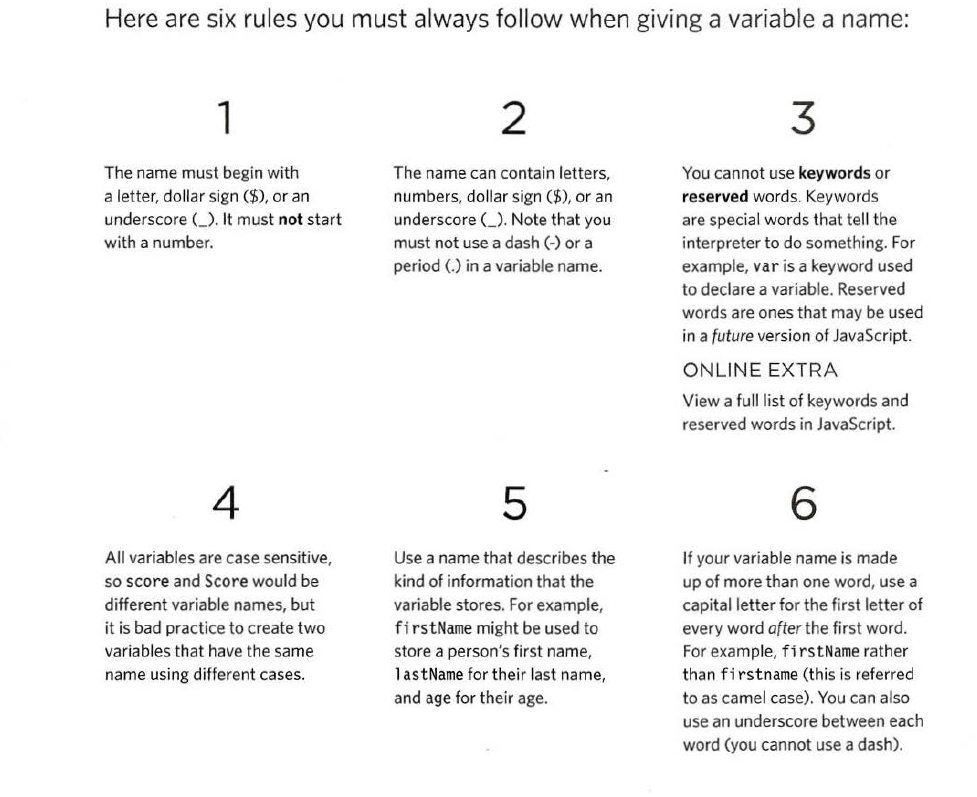
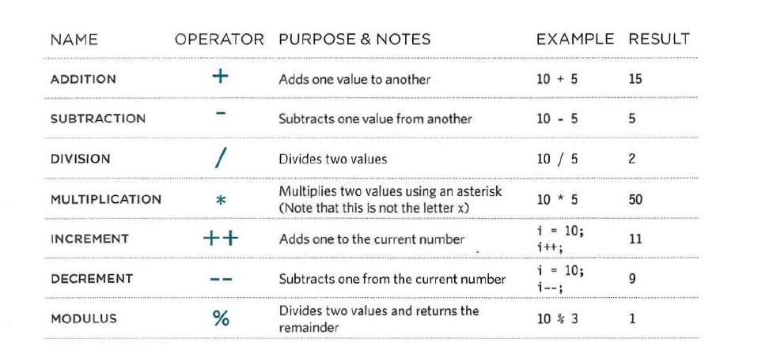
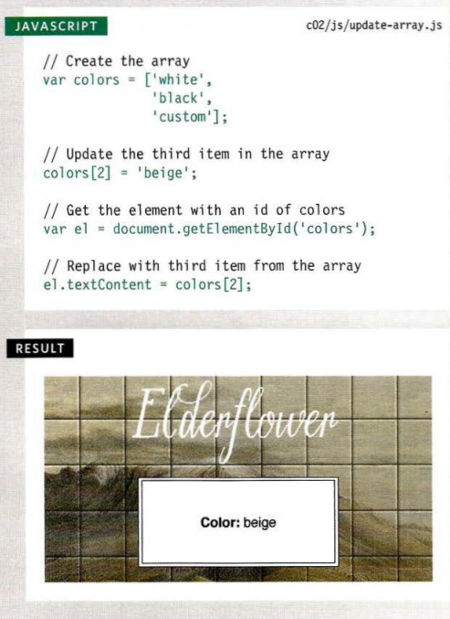
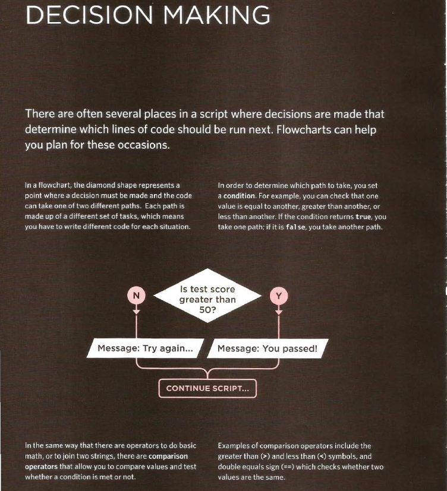
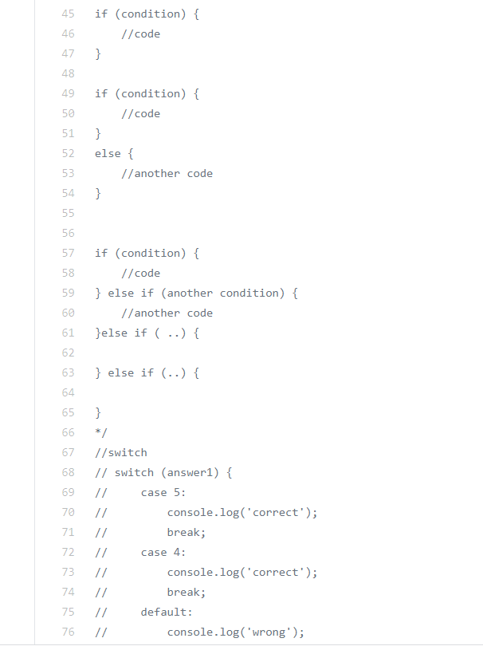

# Read: 02 - HTML Text, CSS Introduction, and Basic JavaScript Instructions
## chapter 2 : Text
### When creating a web page, you add tags (known as markup) to the contents of the page. These tags provide extra meaning and allow browsers to show users the appropriate structure for the page.
### In this chapter we focus on how to add markup to the text that appears on your pages. You will learn about:
- *Structural markup:* the elements that you can use to
describe both headings and paragraphs
- *Semantic markup:* which provides extra information; such
as where emphasis is placed in a sentence, that something
you have written is a quotation (and who said it), the
meaning of acronyms.

## Structural markup
- Headings
- Paragraphs
- Bold & It atlic
- superscript-and-subscript
- White Space
- Line Breaks & Horizontal Rules
## Visual Editors &Their Code views
### Content management systems and HTML editors such as Dreamweaver usually have two views of the page you are creating: a visual editor and a code view.
### Visual editors often resemble word processors.
### Code views show you the codecreated by the visual editor soyou can manually edit it, or so you can just enter new code yourself.
## Semantic Markup
- St rong & Emph asis
- Quotations
- Abbreviations & Acronyms
- Citations & Definitions
- Auth or Details
### HTML elements are used to describe the structure of the page (e.g. headings, subheadings, paragraphs).
### They also provide semantic information (e.g. where emphasis should be placed, the definition of any acronyms used, when given text is a quotation).
## chapter 10 : Introducing CSS
- CSS treats each HTML e XX lement as if it appears inside
its own box and uses rules to indicate how that
element should look.
- Rules are made up of selectors (that specify the
elements the rule applies to) and declarations (that
indicate what these elements should look like).
- Different types of selectors allow you to target your
rules at different elements.
- Declarations are made up of two parts: the properties
of the element that you want to change, and the values
of those properties. For example, the font-family property sets the choice of font, and the value arial
specifies Arial as the preferred typeface.
- CSS rules usually appear in a separate document,
although they may appear within an HTML page.
## From the Duckett JS book:
### Chapter 2: “Basic JavaScript Instructions”
## DATA TYPES:
- NUMERIC DATA TYPE: 0.75
- STRING DATA TYPE : 'come with us'
- BOOLEAN DATA TYPE :true
-------------------------------
## USING A VARIABLE TO STORE A NUMBER
var price;
var quantity;
var total;
price = 5;
quantity = 14;
------------------------------------------
## USING A VARIABLE TO STORE A STRING
username = 'Molly';
message = 'See our upcoming range';
-------------------------------------
## USING A VARIABLE TO STORE A BOOLEAN
var a =true
-------------------------------------
## RULES FOR NAMING

-----------------------------------------
## OPERATORS
### logical  ex: 
    <
    >=
    <=
### ARITHMETIC OPERATORS
   

------------------------------------------
- A script is made up of a series of statements. Each
statement is like a step in a recipe.
- Scripts contain very precise instructions. For example,
you might specify that a value must be remembered
before creating a calculation using that value.
- Variables are used to temporarily store pieces of
information used in the script.
- Arrays are special types of variables that store more
than one piece of related information.
#### exp: 

- JavaScript distinguishes between numbers (0-9),
strings (text), and Boolean values (true or false).
- Expressions evaluate into a single value.
- Expressions rely on operators to calculate a value.
------------------------------------------
## Chapter 4: “Decisions and Loops” only up to the section on switch statements

### we use to do that 
- if statment 
- switch
### example

 
#### To download load all book [check here](https://oiipdf.com/javascript-and-jquery-interactive-front-end-web-development)

