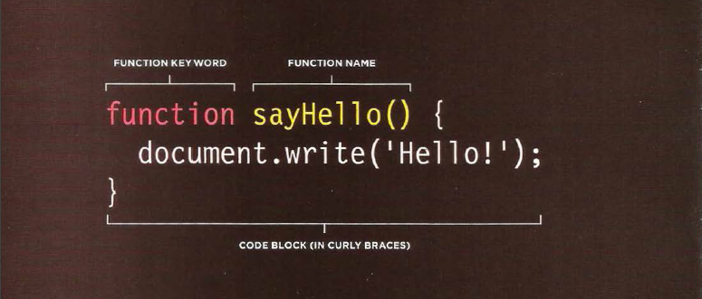

# Read: 04 - HTML Links, CSS Layout, JS Functions
### Links are the defining feature of the web
because they allow you to move from
one web page to another — enabling the
very idea of browsing or surfing.
You will commonly come across the following types of links:
Links f 
- rom one website to another
- Links from one page to another on the same website
- Links from one part of a web page to another part of the
same page
- Links that open in a new browser window
- Links that start up your email program and address a new
email to someone
----------------------------------
- Links are created using the \<a> element.
- The \<a> element uses the href attribute to indicate
the page you are linking to.
- If you are linking to a page within your own site, it is
best to use relative links rather than qualified URLs.
- You can create links to open email programs with an
email address in the "to" field.

- You can use the id attribute to target elements within
a page that can be linked to.
------------------------------------
# Chapter 15: “Layout”
- \
 elements are often used as containing elements
to group together sections of a page.
- Browsers display pages in normal flow unless you
specify relative, absolute, or fixed positioning.
- The float property moves content to the left or right
of the page and can be used to create multi-column
layouts. (Floated items require a defined width.)
- Pages can be fixed width or liquid (stretchy) layouts.
- Designers keep pages within 960-1000 pixels wide,
and indicate what the site is about within the top 600
pixels (to demonstrate its relevance without scrolling).
- Grids help create professional and flexible designs.
     - ex
     
- CSS Frameworks provide rules for common tasks.
- You can include multiple CSS files in one page
-------------------------------------------------------------
## Duckett JS book: Chapter 3 (first part): “Functions, Methods, and Objects”
### Functions let you group a series of statements together to perform aspecific task. If different parts of a script repeat the same task, you can reuse the function (rather than repeating the same set of st atements).
- Functions allow you to group a set of related
statements together that represent a single task.
- Functions can take parameters (informatiorJ required
to do their job) and may return a value.

-----------------------------------------------------------
## How does pair programming work?
#### While there are many different styles, pair programming commonly involves two roles: the Driver and the Navigator. The Driver is the programmer who is typing and the only one whose hands are on the keyboard. Handling the “mechanics” of coding, the Driver manages the text editor, switching files, version control, and—of course writing—code. The Navigator uses their words to guide the Driver but does not provide any direct input to the computer. The Navigator thinks about the big picture, what comes next, how an algorithm might be converted in to code, while scanning for typos or bugs. The Navigator might also utilize their computer as a second screen to look up solutions and documentation, but should not be writing any code.
## Why pair program?
 1. Greater efficiency
 2.  Engaged collaboration
 3.  Learning from fellow students
 4.  Social skills
 5. Job interview readiness
 6. Work environment readiness

 [check her to read about every one ](https://www.codefellows.org/blog/6-reasons-for-pair-programming/)

