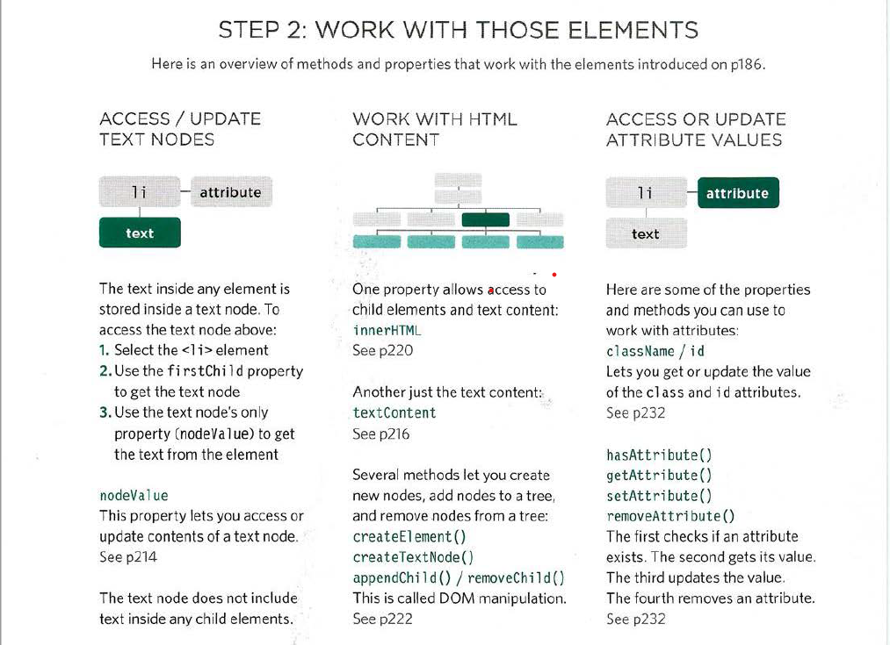

# WHAT IS AN OBJECT?
### Objects group together a set of variables and functions to create a model of a something you would recognize from the real world. In an object, variables and functions take on new names.
- IN AN OBJECT: VARIABLES BECOME KNOWN AS PROPERTIES.
- IN AN OBJECT: FUNCTIONS BECOMEnKNOWN AS METHODS.
## Creating an object 
- Literal natation

-  Accessing an object and dot natation

------------------------------------------------
## Chapter 5 : Document Object Model
### The Document Object Model (DOM) specifies how browsers should create a model of an HTML page and how JavaScript can access and update the contents of a web page while it is in the browser window.
- The browser represents the page using a DOM tree.
- DOM trees have four types of nodes: document nodes,
element nodes, attribute nodes, and text nodes.

------------------------------------------------------------------
- You can select element nodes by their id or class
attributes, by tag name, or using CSS selector syntax.
- The terms elements and element nodes are used interchangeably but when people say the DOM is working with an element, it is actually working with a node that represents that element.

-----------------------------------------------------------------------------------------------------

- DOM queries may return one element, or they may return a Nodelist, which is a collection of nodes.

        exp : methods that select individual element

- From an element node, you can access and update its content using properties such as textContent and innerHTML or using DOM manipulation techniques.

-----------------------------------------------------------------------------------------------------------

- An element node can contain multiple text nodes and child elements that are siblings of each other.
- In older browsers, implementation of the DOM is inconsistent (and is a popular reason for using jQuery).
- Browsers offer tools for viewing the DOM tree .