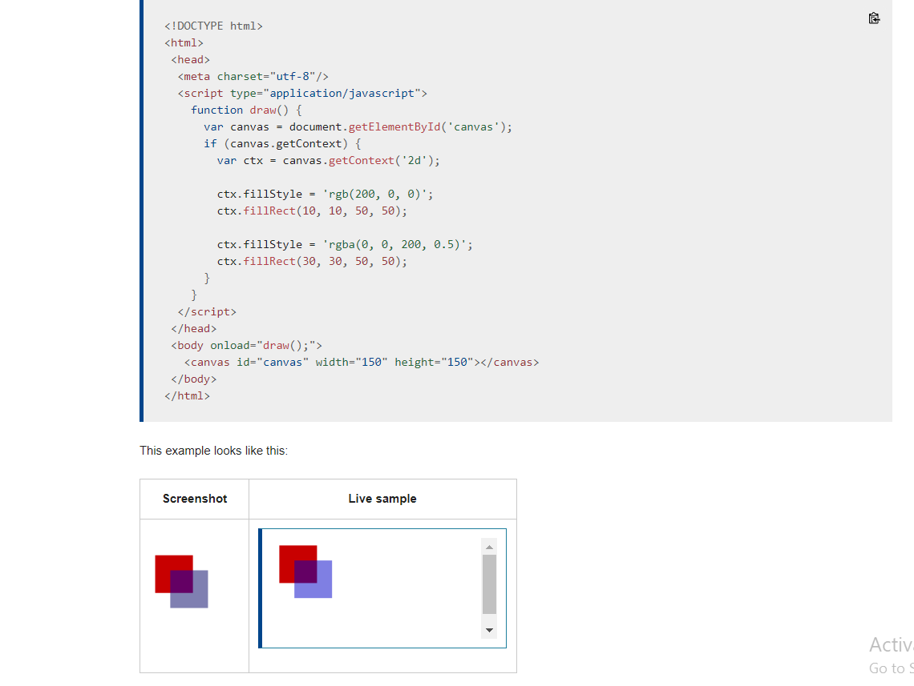
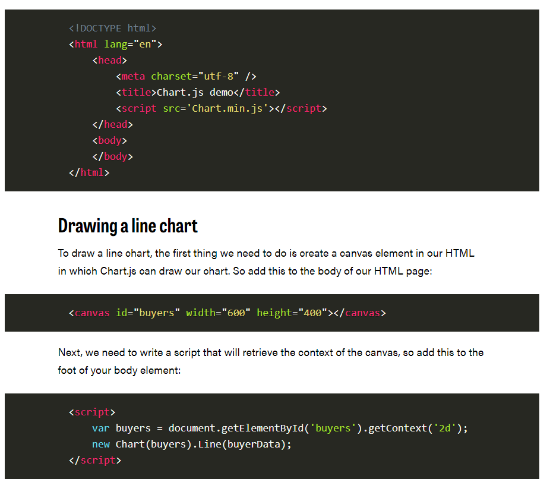
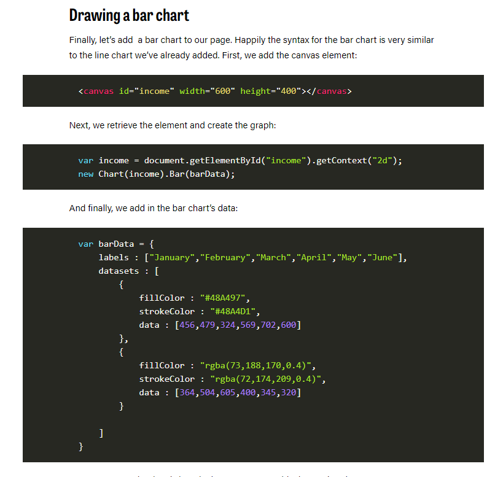

# Basic usage of canvas
#### Let's start this tutorial by looking at the \<canvas> HTML element itself. At the end of this page, you will know how to set up a canvas 2D context and have drawn a first example in your browser.
## The \<canvas> element
         <canvas id="tutorial" width="150" height="150"></canvas>

## Fallback content
          <canvas id="stockGraph" width="150" height="150">
           current stock price: $3.15 + 0.15 </canvas>

           <canvas id="clock" width="150" height="150">
     
         </canvas>

## The rendering context
           var canvas = document.getElementById('tutorial');
             var ctx = canvas.getContext('2d');

## A simple example

-------------------------------------------------------------------
# EASILY CREATE STUNNING ANIMATED CHARTS WITH CHART.JS
### Charts are far better for displaying data visually than tables and have the added benefit that no one is ever going to press-gang them into use as a layout tool. They’re easier to look at and convey data quickly, but they’re not always easy to create.

### A great way to get started with charts is with Chart.js, a JavaScript plugin that uses HTML5’s canvas element to draw the graph onto the page. It’s a well documented plugin that makes using all kinds of bar charts, line charts, pie charts and more, incredibly easy.

### To see how to use chart.js we’re going to create a set of 3 graphs; one will show the number of buyers a fictional product has over the course of 6 months, this will be a line chart; the second will show which countries the customers come from, this will be the pie chart; finally we’ll use a bar chart to show profit over the period.

## Setting up
#### The first thing we need to do is download Chart.js. Copy the Chart.min.js out of the unzipped folder and into the directory you’ll be working in. Then create a new html page and import the script:

#### (We can actually pass some options to the chart via the Line method, but we’re going to stick to the data for now to keep it simple.)

#### Inside the same script tags we need to create our data, in this instance it’s an object that contains labels for the base of our chart and datasets to describe the values on the chart. Add this immediately above the line that begins ‘var buyers=’:example:

                  var buyerData = {
       	labels : ["January","February","March","April","May","June"],
	         datasets : [
		{
			fillColor : "rgba(172,194,132,0.4)",
			strokeColor : "#ACC26D",
			pointColor : "#fff",
			pointStrokeColor : "#9DB86D",
			data : [203,156,99,251,305,247]
		}
	]
      }

## Drawing a pie chart
### Our line chart is complete, so let’s move on to our pie chart. First, we need the canvas element:
        <canvas id="countries" width="600" height="400"></canvas>

### Next, we need to get the context and to instantiate the chart:
          var countries= document.getElementById("countries").getContext("2d");
          new Chart(countries).Pie(pieData, pieOptions);

### You’ll notice that this time, we are going to supply some options to the chart.

### Next we need to create the data. This data is a little different to the line chart because the pie chart is simpler, we just need to supply a value and a color for each section:
               var pieData = [
	{
		value: 20,
		color:"#878BB6"
	},
	{
		value : 40,
		color : "#4ACAB4"
	},
	{
		value : 10,
		color : "#FF8153"
	},
	{
		value : 30,
		color : "#FFEA88"
	}
          ];

### Now, immediately after the pieData we’ll add our options:

            var pieOptions = {
	segmentShowStroke : false,
	animateScale : true
}

### These options do two things, first they remove the stroke from the segments, and then they animate the scale of the pie so that it zooms out from nothing.

