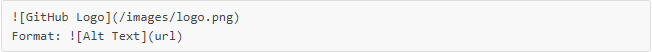
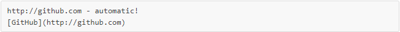

# Mastering Markdown

## What is Markdown?
###  Markdown is a way to style text on the web. You control the display of the document; formatting words as bold or italic, adding images, and creating lists are just a few of the things we can do with Markdown. Mostly, Markdown is just regular text with a few non-alphabetic characters thrown in, like # or *.
### You can use Markdown most places around GitHub:
1. [GIFT](https://gist.github.com/)
2. Comments in Issues and Pull Requests
3. Files with the .md or .markdown extension
## Syntax guide
- **Headers**  use #
- **Lists**    use - or 1. 2.
- **Images** use

- **Links** use 

- **Emphasis**
### You can indicate emphasis with bold, italic, or strikethrough text in comment fields and .md files.

| Style| Syntax |
|------------ | -------------|
| Bold| ** ** or __ __	|
| Italic| * * or _ _	|
|Strikethrough| ~~ ~~	|

## TO more information [check here](https://guides.github.com/features/mastering-markdown/)

