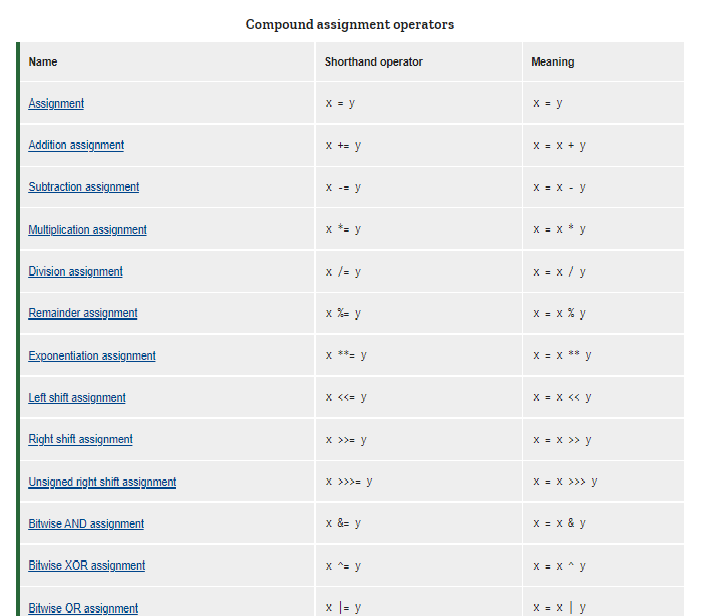
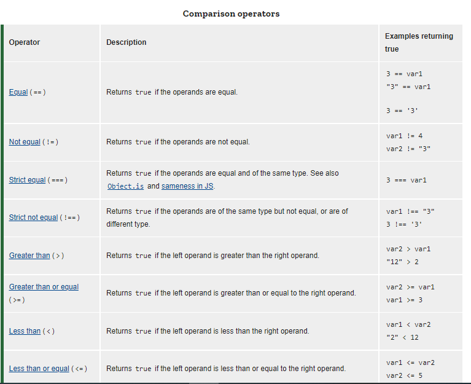

# Programming with JavaScript 
## Control flow
#### The control flow is the order in which the computer executes statements in a script.

#### Code is run in order from the first line in the file to the last line, unless the computer runs across the (extremely frequent) structures that change the control flow, such as conditionals and loops. 
## 1. Operators
#### JavaScript has the following types of operators. This section describes the operators and contains information about operator precedence.

* Assignment operators
* Comparison operators
* Arithmetic operators
* Bitwise operators
* Logical operators
* String operators
* Conditional (ternary) operator
* Comma operator
* Unary operators
* Relational operators

### Assignment operators
#### An assignment operator assigns a value to its left operand based on the value of its right operand. The simple assignment operator is equal (=), which assigns the value of its right operand to its left operand. That is, x = y assigns the value of y to x.

#### There are also compound assignment operators that are shorthand for the operations listed in the following table:

### Comparison operators
#### A comparison operator compares its operands and returns a logical value based on whether the comparison is true. The operands can be numerical, string, logical, or object values. Strings are compared based on standard lexicographical ordering, using Unicode values. In most cases, if the two operands are not of the same type, JavaScript attempts to convert them to an appropriate type for the comparison. This behavior generally results in comparing the operands numerically. The sole exceptions to type conversion within comparisons involve the === and !== operators, which perform strict equality and inequality comparisons. These operators do not attempt to convert the operands to compatible types before checking equality. The following table describes the comparison operators in terms of this sample code:

JavaScript Arithmetic Operators
Arithmetic operators are used to perform arithmetic on numbers:
### Arithmetic operators
|Operator|	Description|
|--------|-------------|
|+	|Addition|
|-	|Subtraction|
|*	|Multiplication|
|**	|Exponentiation |
|/	|Division|
|%	|Modulus (Division Remainder)|
|++	|Increment|
|--	|Decrement|
## Logical Operators
|Operator|	Description|
|--------|-------------|
|&&	|logical and|
| \|\|	| logical or|
|!|	logical not|

To learn more Operator [check here](https://developer.mozilla.org/en-US/docs/Web/JavaScript/Guide/Expressions_and_Operators#unary_operators)
## 2. JavaScript Functions
####  A JavaScript function is a block of code designed to perform a particular task.

#### A JavaScript function is executed when "something" invokes it (calls it).
### JavaScript Function Syntax

#### A JavaScript function is defined with the function keyword, followed by a name, followed by parentheses ().

#### Function names can contain letters, digits, underscores, and dollar signs (same rules as variables).

#### The parentheses may include parameter names separated by commas:
#### (parameter1, parameter2, ...)

#### The code to be executed, by the function, is placed inside curly brackets: {}

function name(parameter1, parameter2, parameter3) {
  // code to be executed
}

That is the first type to know more [check here](https://developer.mozilla.org/en-US/docs/Web/JavaScript/Guide/Functions)

